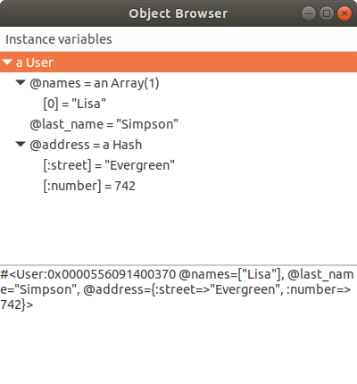
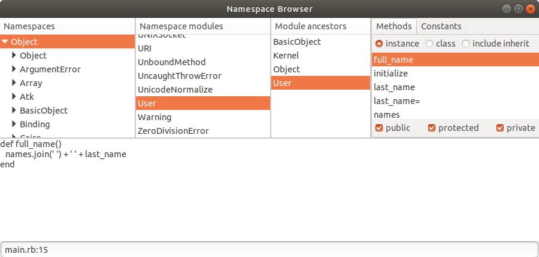
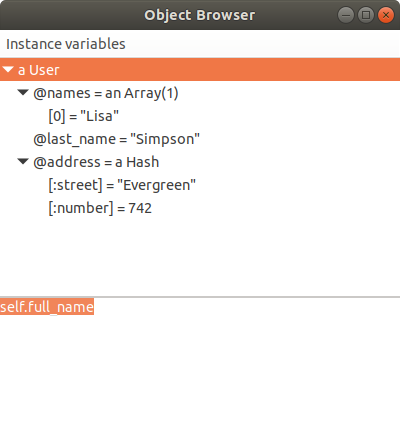

# Sirens

*Sirens* gives Ruby developers some simple and interactive utilities to ease development, testing and learning Ruby.

These utilities are written in Ruby and use gtk3 as its GUI support.

### Installation

#### Pre requisites

```
apt install libglib2.0-dev
```

In the project Gemfile add the following gem:

```ruby
group :test, :development do
    gem 'sirens'
end
```

and install the bundles with:

```
bundle install
```

### Usage

First require the gem:

```ruby
require 'rubygems'
require 'bundler/setup'

require 'sirens'
```

then open a browser in any part of the application or in a test with:

```
Sirens.browse(object: user)
```

An object browser will pop up and will show the structure of the object:



By right clicking on any instance variable in the tree it is possible to pop up a new browser on its namespace, class, ancestors, methods and constants:



It is also possible to browse an object class from any part of the application with:

```
Sirens.browse(klass: user)
```


The browser binds `self` to the selected object in the tree and it's possible to send messages to it or
evaluate code and browse the result:




### Testing

Run the tests with

```
bundle exec rspec
```

### References

These utilities are heavily based in the Smalltalk browsers, in particular in the [Object Arts](https://www.object-arts.com/)
implementation named [Dolphin Smalltalk](https://github.com/dolphinsmalltalk/Dolphin), which I fancy for its
outstanding beauty.

I started a similar framework some years ago implementing a custom GTK+ GUI framework inspired in [Shoes](http://shoesrb.com/)
and [Dolphin's MVP framework](http://www.object-arts.com/downloads/docs/index.html?compositemvpcomponent.htm) but then
I dropped the project.

I recently learned [React](https://reactjs.org/) and I liked very much its simplicity and its declarative DSL.

I decided to re-implement these utilities from scratch using a DSL similar to [Shoes](http://shoesrb.com/)
(which also resembles React JSX) but bringing back the models to it, adding a custom layer of
[composable models](https://github.com/haijin-development/ruby-sirens/tree/master/lib/models)
to handle most of the information updates between components instead of [lifting up the state](https://reactjs.org/tutorial/tutorial.html#lifting-state-up-again)
to a common ancestor.

I think the [final result](https://github.com/haijin-development/ruby-sirens/tree/master/lib/sirens) is both very
simple to use and highly adaptable and its worth looking at it.

Up to a certain point the graphics code remains in the View layer, so it would be possible to switch to any graphics
library, be it GTK+ or QT.

I like this implementation much better than the previous one I did several years ago and it could be spin-off to a GTK+
gem on its own, but currently there are no plans to do that.